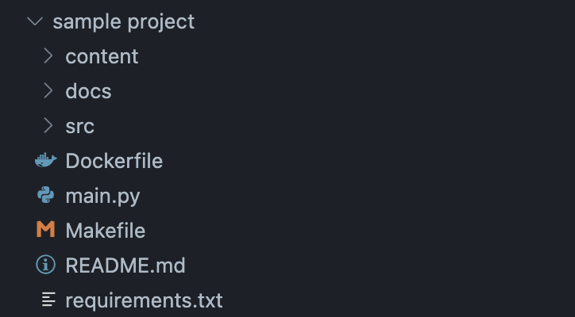
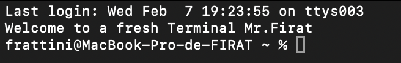

# Create a well-structured python project and its repository on GitHub

It is a software engineering routine to create a project and store it a remote repository. I have written scripts to automatise this task for python projects. These scripts can potentially save you ~10 minutes per project. 🙃

_TL;DR This is a one-click solution to create a typical python project folder structure and its GitHub repository. See the image of the folder structure_

<div align="center">

</div>

## 1. Introduction

Managing and setting up a professional Python project often involves creating a well-organised directory structure, setting up a virtual environment, and possibly creating a corresponding GitHub repository. To streamline these tasks, I've developed two Bash scripts that automate these processes. In this guide, I'll walk you through the usage of these scripts and how to integrate them seamlessly into your workflow.

My aim is to provide the tools to effortlessly maintain a standardised and efficient project structure. These scripts speed up the starting a project and make sure you're following good practices for how files are set up.

## 2. Getting started

1. Install GitHub CLI, the tool to manage GitHub from terminal.

```shell
brew install gh
```

2. Log in to GitHub

```shell
gh auth login
```

You can verify the log in status

```shell
gh auth status
```

3. It is good to put the scripts in a dedicated folder. For example, my scripts are located in `/Documents/Scripts/` folder. Later on, we will make these scripts globally executable without specifying the full path.
4. Clone this repository to use the scripts.

## 3. Use `python.sh` to create a folder structure for a professional python project

The `python.sh` script automates the creation of a professional Python project structure, complete with a Makefile for various tasks. Here's an overview:

- **Folder Structure:**
    - `src/`: Modules of the project.
    - `docs/`: Documentation files.
    - `content/`: Additional project content.
- **README.md:** Includes an overview, requirements, setup instructions, and a Makefile guide.
- **main.py:** A placeholder for your Python script.
- **Makefile:** Provides targets for creating a virtual environment, installing dependencies, code formatting, linting, and cleanup.
- **Dockerfile** A typical Dockerfile. 

Follow the prompts to enter the folder location and name. The script will create the project structure and provide setup instructions. 

**Note:** For the folder name you don't need to use hyphens. For instance,

- ``python.sh`` creates a folder: **advanced tutorial kubernetes**
- ``github.sh`` creates a repo: **advanced-tutorial-kubernetes**

In the provided script, you'll notice a file named `Makefile`. A `Makefile` is a special file used in software development to automate tasks and manage dependencies. It contains rules and commands that can be executed with a simple command in the terminal. For instance, if you run ``make black`` on terminal, this will format ``.py`` files using the `black` formatter which will ensure consistent code style within your project. 

## 4. Use `github.sh` to create the corresponding repository on GitHub

Now the project is ready. After running the `python.sh` script, you have the option to create a corresponding GitHub repository using the `github.sh` script. This script prompts you for a repository description and automates the repository creation on GitHub.

Note that to use the script `github.sh` separately if you need:

```sh
bash github.sh <folder_name> <folder_location>
```

For example,

```sh
sh github.sh "Sample Project Name" $pwd
```

## 5. Further automatisation

I prefer to use my scripts wherever I want. Using ``cd`` into folders to run the scripts is not a bad idea, however the better is to put somewhere and call them whenever you want. 

A better way is to integrate these scripts into your shell environment. This guide assumes the use of zsh, but adjustments can be made for other shells.

1. Create a hidden file ``~/.zshrc`` to store the file path for you scripts.

```sh
nano ~/.zshrc
```

Add the following lines to the file:

```sh
export PATH=$PATH:/path/to/your/scripts/directory/scripts
export NOTES_FILE="/path/to/your/file/notes.txt"
```

For instance, mines are

```sh
export PATH=$PATH:/Users/frattini/Documents/Scripts
export NOTES_FILE="/Users/frattini/Documents/Scripts/notes.txt"
```

As seen easily NOTES_FILE is just a variable. The terminal will automatically read and use it. But what is PATH here? 


Well... The `PATH` environment variable is a fundamental variable in Unix-like operating systems, including Linux and macOS. It's typically set up by default when a user logs in, often with a default set of directories relevant to system binaries and user-installed binaries. 

The purpose of adding directories to the `PATH` is to make it easier to execute programs located in those directories from anywhere in your terminal, without needing to specify the full path to the executable each time.

Since my scripts are in the directory `/Users/frattini/Documents/Scripts`, and I have added `/Users/frattini/Documents/Scripts` to my `PATH`, I can execute `myscript.sh` from anywhere in the terminal by simply typing `name_of_script.sh`.

Save the file and exit the text editor. (control O to override; enter; then control X to quit nano)

2. Apply the changes by running:

```sh
source ~/.zshrc
```

The `source` command (or `.`) is used to execute commands from a file in the current shell session. When you run `source ~/.zshrc` or `source ~/.bash_profile`, you are essentially telling the shell to read and execute the commands from the specified file (`~/.zshrc` or `~/.bash_profile`) as if they were entered directly into the command line. Whenever you launch a new terminal, the commands in the ``/.zshrc`` file will be already executed. That means,
- Your terminal will recognise the variables
- The commands are run 

I put a funny welcome message 😂

```sh
echo "Welcome to a fresh Terminal Mr.Firat"
```
<div align="center">

</div>

When modifying the `PATH` environment variable, using `source` is necessary because changes to the environment variables made in a script or a configuration file won't persist to the current shell session if the script is run in a sub-shell. By sourcing the file, you apply those changes directly to the current shell.

3. Now whatever your pwd is, you can run your scripts

---

These libraries are required to run certain commands in Makefile: 
- pylint
- black
- pyenv
- gh (for github)

Final words... 

You can enhance your Python project workflow by automating setup tasks and repository creation bu following this guide. This approach guarantees consistency and saves time and it is super easy to customize these scripts to fit your specific project needs.

---

<div style="text-align:center; margin-top: 40px;">

[](https://www.buymeacoffee.com/frattini)
</div>


